## 1. アプリを使い始めたい（初回登録・認証）

### 1.1 新規登録をして使い始めたい（初回登録フロー）

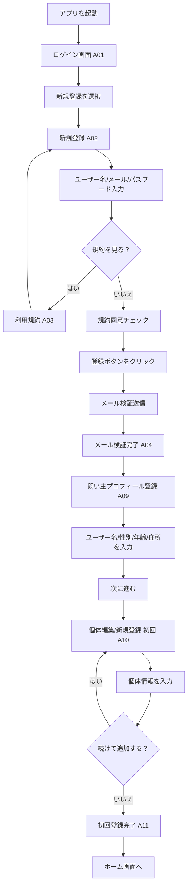

### 1.2 ログインして使い始めたい（ログインフロー）

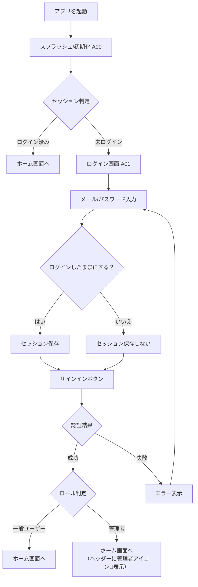

### 1.3 パスワードを忘れたので再設定したい

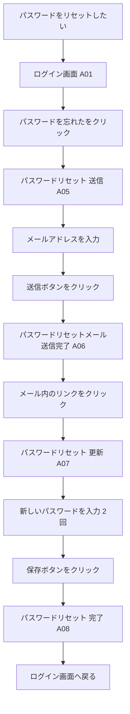

---

## 2. 日々の記録をつけたい（ホーム・記録）

### 2.1 お世話のリマインダーを設定・確認・完了したい

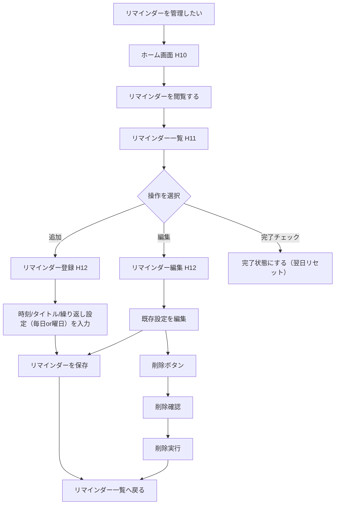

### 2.2 今日の健康記録（食事・排泄・体重など）をつけたい

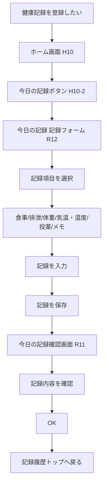

### 2.3 過去の記録やグラフを確認したい

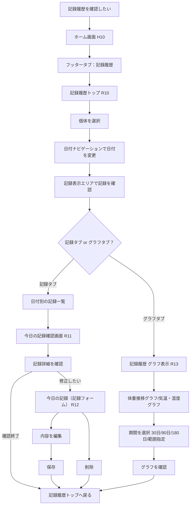

---

## 3. 予定を管理・記録したい（カレンダー・通院）

### 3.1 カレンダーで予定を確認したい

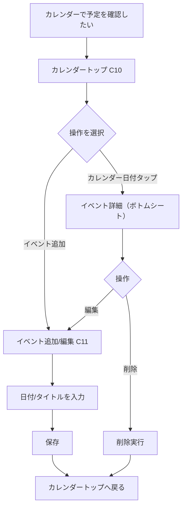

### 3.2 通院記録（病院の記録）をつけたい

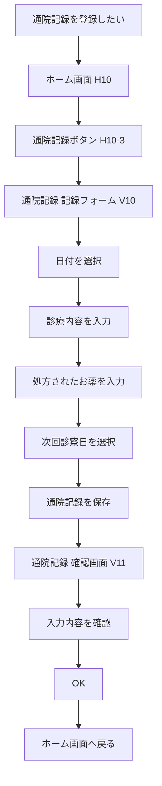

### 3.3 病院を探したい（マップ）

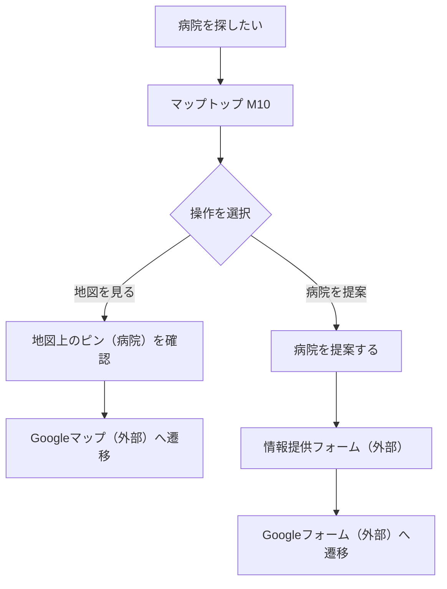

---

## 4. ハリネズミの情報を管理したい（個体登録）

### 4.1 新しくハリネズミを登録したい・情報を修正したい

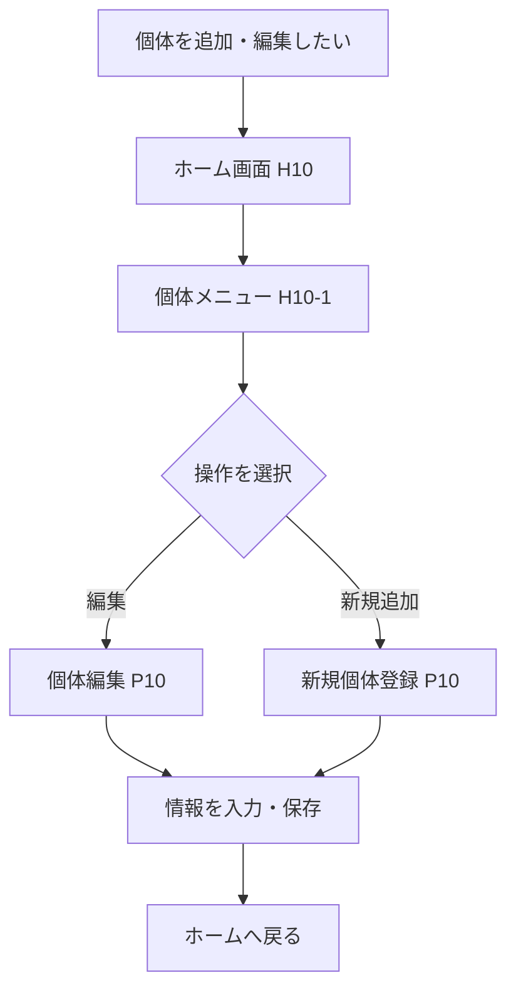

### 4.2 表示する個体を切り替えたい

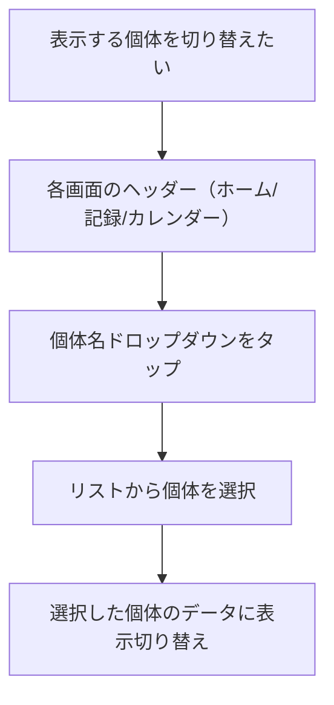

---

## 5. アプリの設定・情報を確認したい（その他）

### 5.1 通知（お知らせ・アラート）を確認したい

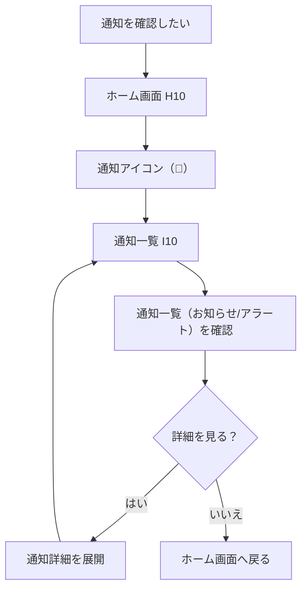

### 5.2 飼い主プロフィールを確認・変更したい

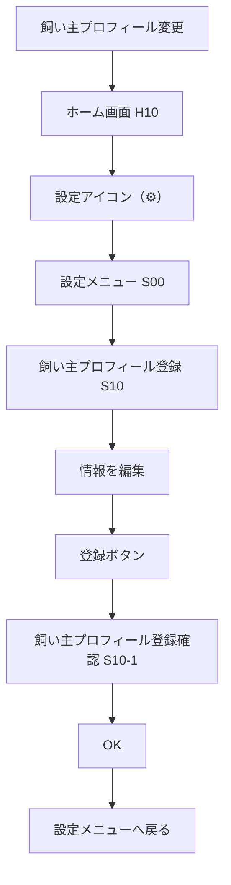

### 5.3 通知設定（プッシュ通知など）を変更したい

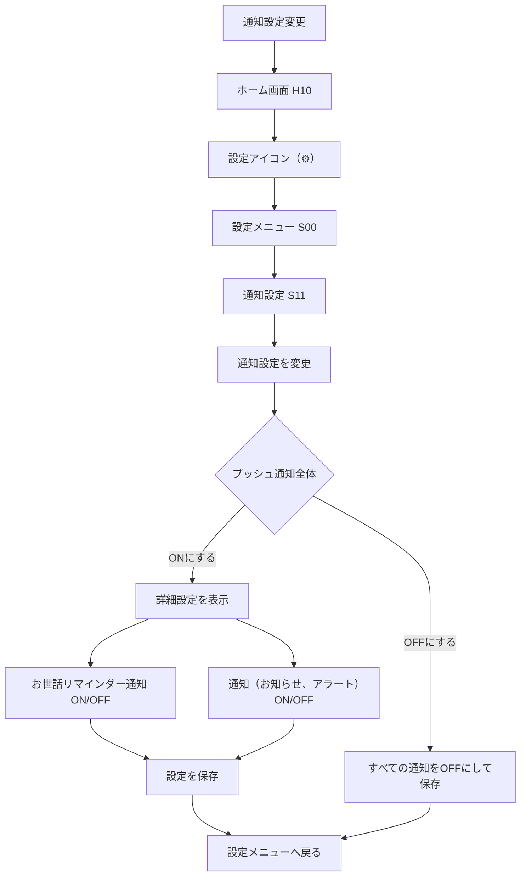

### 5.4 利用規約を確認したい

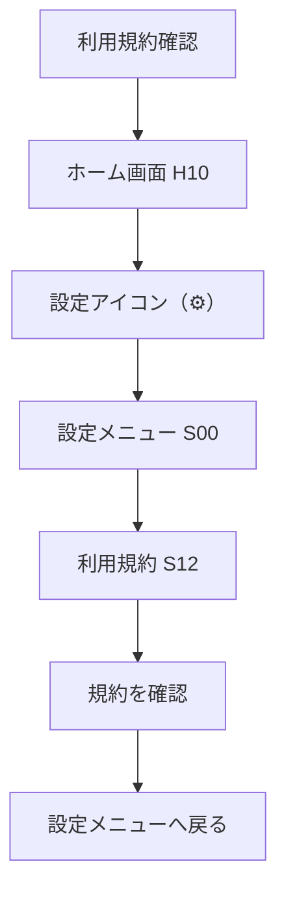

### 5.5 アプリを退会したい

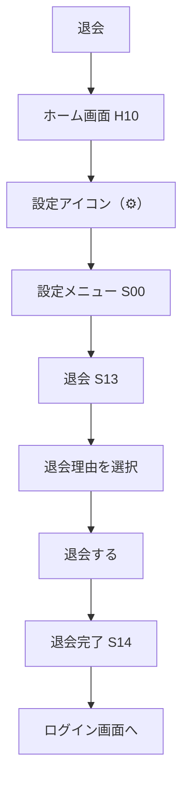

### 5.6 協会公式サイト・SNS・お問い合わせ

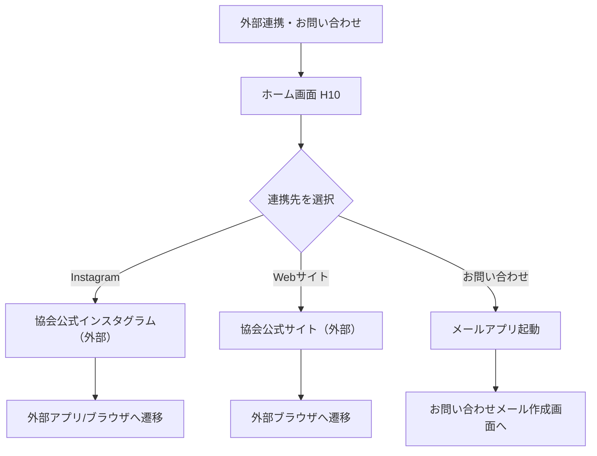

### 5.7 ログアウトしたい

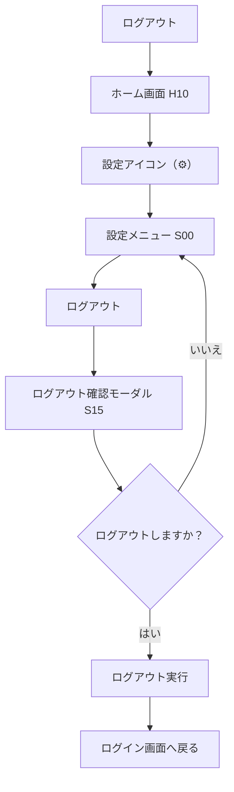

---

## 6. 協会・管理者向け機能

### 6.1 登録状況（KPI）を確認したい

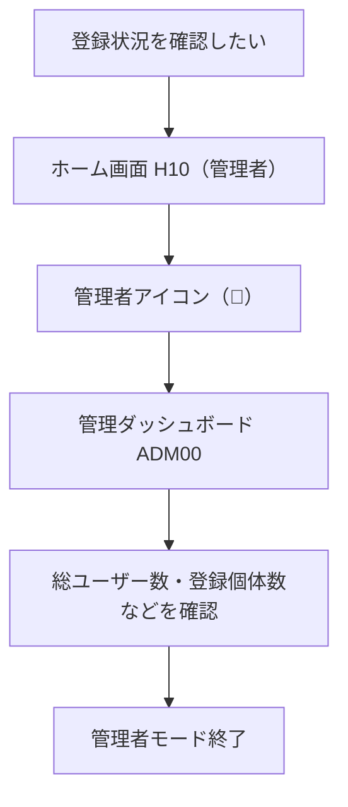

### 6.2 データを分析したい（CSVエクスポート）

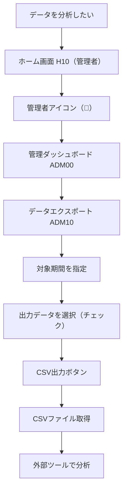

### 6.3 お知らせを配信したい（お知らせ管理）

```mermaid
flowchart TD
    A[お知らせを配信したい] --> B[ホーム画面 H10（管理者）]
    B --> C[管理者アイコン（🔧）]
    C --> D[管理ダッシュボード ADM00]
    D --> E[お知らせ管理 ADM20]
    E --> F{操作を選択}
    F -->|新規作成| G[新規お知らせモーダル]
    F -->|編集| H[お知らせの編集モーダル]
    F -->|削除| I[削除確認]
    G --> J[タイトル・本文入力]
    J --> K[公開するトグル ON/OFF]
    K --> L[公開する/保存する]
    L --> M[お知らせ管理へ戻る]
    H --> N[内容修正]
    N --> O[公開するトグル ON/OFF]
    O --> P[更新する]
    P --> M
    I --> Q[削除実行]
    Q --> M
```
