**プロジェクト名**: Hariness（ハリネス）  
**作成日**: 2025年12月18日  
**作成者**: 城田 航

---

## 1. ER図 (Mermaid)

```mermaid
erDiagram

    %% =========================
    %% リレーション定義
    %% =========================

    USERS ||--o{ HEDGEHOGS : has
    USERS ||--o{ CARE_REMINDERS : sets
    USERS ||--o{ CALENDAR_EVENTS : creates
    USERS ||--o{ NEWS : writes
    USERS ||--o{ ALERT_HISTORY : receives
    USERS ||--o{ NEWS_READ_STATUS : reads

    HEDGEHOGS ||--o{ WEIGHT_RECORDS : records
    HEDGEHOGS ||--o{ MEAL_RECORDS : records
    HEDGEHOGS ||--o{ EXCRETION_RECORDS : records
    HEDGEHOGS ||--o{ ENVIRONMENT_RECORDS : records
    HEDGEHOGS ||--o{ MEDICATION_RECORDS : records
    HEDGEHOGS ||--o{ MEMO_RECORDS : writes
    HEDGEHOGS ||--o{ HOSPITAL_VISITS : visits

    NEWS ||--o{ NEWS_READ_STATUS : read_by

    %% =========================
    %% テーブル定義
    %% =========================

    USERS {
        uuid id PK
        string email
        string display_name
        string avatar_url
        string gender
        string age_group
        string prefecture
        string role
        boolean is_push_enabled
        boolean is_reminder_notification_enabled
        boolean is_alert_notification_enabled
        boolean is_news_notification_enabled
        timestamp created_at
        timestamp last_login_at
        timestamp updated_at
    }

    HEDGEHOGS {
        uuid id PK
        uuid user_id FK "ON DELETE CASCADE"
        string name
        string gender
        date birth_date
        date welcome_date
        string image_url
        text features
        string insurance_number
        timestamp created_at
        timestamp updated_at
    }

    WEIGHT_RECORDS {
        uuid id PK
        uuid hedgehog_id FK "ON DELETE CASCADE"
        integer weight
        date record_date
        timestamp created_at
    }

    MEAL_RECORDS {
        uuid id PK
        uuid hedgehog_id FK "ON DELETE CASCADE"
        date record_date
        time record_time
        string content
        decimal amount
        string amount_unit
        timestamp created_at
    }

    EXCRETION_RECORDS {
        uuid id PK
        uuid hedgehog_id FK "ON DELETE CASCADE"
        date record_date
        time record_time
        string condition
        text details
        timestamp created_at
    }

    ENVIRONMENT_RECORDS {
        uuid id PK
        uuid hedgehog_id FK "ON DELETE CASCADE"
        date record_date
        decimal temperature
        decimal humidity
        timestamp created_at
    }

    MEDICATION_RECORDS {
        uuid id PK
        uuid hedgehog_id FK "ON DELETE CASCADE"
        date record_date
        time record_time
        string medicine_name
        timestamp created_at
    }

    MEMO_RECORDS {
        uuid id PK
        uuid hedgehog_id FK "ON DELETE CASCADE"
        date record_date
        text content
        timestamp created_at
    }

    HOSPITAL_VISITS {
        uuid id PK
        uuid hedgehog_id FK "ON DELETE CASCADE"
        date visit_date
        string title
        string diagnosis
        text treatment
        jsonb medicine_prescription
        date next_visit_date
        timestamp created_at
    }

    CARE_REMINDERS {
        uuid id PK
        uuid user_id FK "ON DELETE CASCADE"
        string title
        time target_time
        boolean is_repeat
        string frequency
        string days_of_week
        boolean is_enabled
        date last_completed_date
        timestamp created_at
    }

    CALENDAR_EVENTS {
        uuid id PK
        uuid user_id FK "ON DELETE CASCADE"
        date event_date
        string title
        timestamp created_at
    }

    NEWS {
        uuid id PK
        string title
        text content
        boolean is_published
        timestamp published_at
        uuid created_by FK "ON DELETE SET NULL"
        timestamp created_at
        timestamp updated_at
    }

    NEWS_READ_STATUS {
        uuid user_id FK "ON DELETE CASCADE"
        uuid news_id FK "ON DELETE CASCADE"
        timestamp read_at
        timestamp created_at
    }

    ALERT_HISTORY {
        uuid id PK
        uuid user_id FK "ON DELETE CASCADE"
        uuid hedgehog_id FK "ON DELETE SET NULL"
        string alert_type
        string message
        boolean is_read
        timestamp created_at
    }

    WITHDRAWAL_LOGS {
        uuid id PK
        uuid user_id
        string email_hash
        string reason
        timestamp withdrawn_at
        string age_group
        string gender
        string prefecture
        integer hedgehog_count
        integer days_used
    }
```

## 2. 補足解説

### ER図の見方 (凡例)

- **||--o{**: 1対多の関係 (1つの親に対して、0個以上の子供が存在する)
- **PK (Primary Key)**: 主キー。データを一意に特定するためのID。
- **FK (Foreign Key)**: 外部キー。他のテーブルのデータと紐付けるためのID。

#### リレーション名の意味

ER図内で使用されているリレーション名の意味：

| リレーション名 | 意味           | 使用例                                                                  |
| :------------- | :------------- | :---------------------------------------------------------------------- |
| **has**        | 所有・持つ     | USERS has HEDGEHOGS（ユーザーはハリネズミを所有する）                   |
| **sets**       | 設定する       | USERS sets CARE_REMINDERS（ユーザーはリマインダーを設定する）           |
| **creates**    | 作成する       | USERS creates CALENDAR_EVENTS（ユーザーはカレンダーイベントを作成する） |
| **writes**     | 記述する・書く | USERS writes NEWS（ユーザーはお知らせを書く）                           |
| **receives**   | 受け取る       | USERS receives ALERT_HISTORY（ユーザーはアラート履歴を受け取る）        |
| **reads**      | 読む           | USERS reads NEWS_READ_STATUS（ユーザーはお知らせを読む）                |
| **records**    | 記録する       | HEDGEHOGS records WEIGHT_RECORDS（ハリネズミは体重記録を記録する）      |
| **visits**     | 訪問する       | HEDGEHOGS visits HOSPITAL_VISITS（ハリネズミは病院を訪問する）          |
| **read_by**    | 読まれる       | NEWS read_by NEWS_READ_STATUS（お知らせは既読状況によって読まれる）     |

---

## 3. テーブル一覧

| No. | テーブル名              | 論理名             | 概要                                     |
| :-- | :---------------------- | :----------------- | :--------------------------------------- |
| 1   | **USERS**               | ユーザー           | アプリ利用者（飼い主）および管理者の情報 |
| 2   | **HEDGEHOGS**           | 個体               | 飼育しているハリネズミのプロフィール     |
| 3   | **WEIGHT_RECORDS**      | 体重記録           | 日々の体重データ                         |
| 4   | **MEAL_RECORDS**        | 食事記録           | 食事の内容と量の記録                     |
| 5   | **EXCRETION_RECORDS**   | 排泄記録           | 排泄の状態と異常時のメモ                 |
| 6   | **ENVIRONMENT_RECORDS** | 環境記録           | ケージ内の気温と湿度                     |
| 7   | **MEDICATION_RECORDS**  | 投薬記録           | 投薬の履歴                               |
| 8   | **MEMO_RECORDS**        | メモ記録           | 自由記述の日記・メモ                     |
| 9   | **HOSPITAL_VISITS**     | 通院記録           | 動物病院での診療・処方記録               |
| 10  | **CARE_REMINDERS**      | お世話リマインダー | ルーティン作業の通知設定                 |
| 11  | **CALENDAR_EVENTS**     | カレンダーイベント | ユーザー作成の任意イベント               |
| 12  | **NEWS**                | お知らせ           | 運営からのお知らせ記事                   |
| 13  | **NEWS_READ_STATUS**    | お知らせ既読状況   | ユーザーごとのお知らせ既読管理           |
| 14  | **ALERT_HISTORY**       | アラート履歴       | 健康異常検知の履歴                       |
| 15  | **WITHDRAWAL_LOGS**     | 退会ログ           | 退会理由および分析用属性データの保存     |

---

## 4. テーブル定義詳細

### 共通事項

- **データ型について**: PostgreSQL (Supabase) を採用するため、文字列は基本的に `text` 型を使用します（桁数制限はアプリ側で行います）。
- **NULL許容について**: `YES` の場合はデータの省略が可能（Optional）です。空欄の場合は必須（Required）です。

### 👤 ユーザー・個体管理

#### 1. **USERS** (ユーザー)

アプリを利用するユーザー（飼い主）情報を管理します。Supabase Auth の `auth.users` と紐付きます。

| 論理名               | カラム名                           | データ型  | Key | NULL許容 | 初期値 | 備考                                         |
| :------------------- | :--------------------------------- | :-------- | :-: | :------: | :----- | :------------------------------------------- |
| ユーザーID           | `id`                               | uuid      | PK  |          | -      | Supabase Authと連携                          |
| メールアドレス       | `email`                            | text      |     |          | -      | Unique制約                                   |
| ユーザー名           | `display_name`                     | text      |     |          | -      |                                              |
| プロフィール画像URL  | `avatar_url`                       | text      |     |   YES    | -      | Storageのパス                                |
| 性別                 | `gender`                           | text      |     |   YES    | -      | 男性/女性/回答しない 等                      |
| 年代                 | `age_group`                        | text      |     |   YES    | -      | '10s', '20s', '30s', '40s', '50s', '60_over' |
| 居住地               | `prefecture`                       | text      |     |   YES    | -      | 都道府県、海外                               |
| 権限                 | `role`                             | text      |     |          | 'user' | `user`:一般, `admin`:管理者                  |
| プッシュ通知設定     | `is_push_enabled`                  | boolean   |     |          | true   | 全体のON/OFF                                 |
| リマインダー通知設定 | `is_reminder_notification_enabled` | boolean   |     |          | true   |                                              |
| アラート通知設定     | `is_alert_notification_enabled`    | boolean   |     |          | true   |                                              |
| お知らせ通知設定     | `is_news_notification_enabled`     | boolean   |     |          | true   |                                              |
| アカウント作成日時   | `created_at`                       | timestamp |     |          | now()  |                                              |
| 最終ログイン日時     | `last_login_at`                    | timestamp |     |   YES    | -      | 分析用                                       |
| 情報更新日時         | `updated_at`                       | timestamp |     |          | now()  |                                              |

#### 2. **HEDGEHOGS** (個体)

飼育しているハリネズミの個体情報です。

| 論理名         | カラム名           | データ型  | Key | NULL許容 | 初期値 | 備考           |
| :------------- | :----------------- | :-------- | :-: | :------: | :----- | :------------- |
| 個体ID         | `id`               | uuid      | PK  |          | -      | 自動生成       |
| 飼い主ID       | `user_id`          | uuid      | FK  |          | -      | USERS.id       |
| 名前           | `name`             | text      |     |          | -      |                |
| 性別           | `gender`           | text      |     |   YES    | -      | オス/メス/不明 |
| 生年月日       | `birth_date`       | date      |     |   YES    | -      |                |
| お迎え日       | `welcome_date`     | date      |     |   YES    | -      |                |
| 写真URL        | `image_url`        | text      |     |   YES    | -      | Storageのパス  |
| 見た目の特徴   | `features`         | text      |     |   YES    | -      | 自由記述       |
| ペット保険番号 | `insurance_number` | text      |     |   YES    | -      |                |
| 登録日時       | `created_at`       | timestamp |     |          | now()  |                |
| 更新日時       | `updated_at`       | timestamp |     |          | now()  |                |

---

### 📝 健康記録 (Vital Records)

#### 3. **WEIGHT_RECORDS** (体重記録)

| 論理名   | カラム名      | データ型  | Key | NULL許容 | 初期値 | 備考           |
| :------- | :------------ | :-------- | :-: | :------: | :----- | :------------- |
| 記録ID   | `id`          | uuid      | PK  |          | -      |                |
| 個体ID   | `hedgehog_id` | uuid      | FK  |          | -      | HEDGEHOGS.id   |
| 体重     | `weight`      | integer   |     |          | -      | 単位: g (整数) |
| 記録日   | `record_date` | date      |     |          | -      |                |
| 作成日時 | `created_at`  | timestamp |     |          | now()  |                |

#### 4. **MEAL_RECORDS** (食事記録)

| 論理名   | カラム名      | データ型  | Key | NULL許容 | 初期値 | 備考                             |
| :------- | :------------ | :-------- | :-: | :------: | :----- | :------------------------------- |
| 記録ID   | `id`          | uuid      | PK  |          | -      |                                  |
| 個体ID   | `hedgehog_id` | uuid      | FK  |          | -      | HEDGEHOGS.id                     |
| 記録日   | `record_date` | date      |     |          | -      |                                  |
| 記録時刻 | `record_time` | time      |     |          | -      |                                  |
| 食事内容 | `content`     | text      |     |          | -      | フード名など                     |
| 量       | `amount`      | decimal   |     |   YES    | -      | 単位: amount_unit参照 (小数許容) |
| 単位     | `amount_unit` | text      |     |   YES    | -      | `g`, `スプーン` 等               |
| 作成日時 | `created_at`  | timestamp |     |          | now()  |                                  |

#### 5. **EXCRETION_RECORDS** (排泄記録)

| 論理名   | カラム名      | データ型  | Key | NULL許容 | 初期値 | 備考                   |
| :------- | :------------ | :-------- | :-: | :------: | :----- | :--------------------- |
| 記録ID   | `id`          | uuid      | PK  |          | -      |                        |
| 個体ID   | `hedgehog_id` | uuid      | FK  |          | -      | HEDGEHOGS.id           |
| 記録日   | `record_date` | date      |     |          | -      |                        |
| 記録時刻 | `record_time` | time      |     |          | -      |                        |
| 状態     | `condition`   | text      |     |          | -      | `正常` / `異常`        |
| 詳細メモ | `details`     | text      |     |   YES    | -      | 異常時(軟便、血便など) |
| 作成日時 | `created_at`  | timestamp |     |          | now()  |                        |

#### 6. **ENVIRONMENT_RECORDS** (環境記録)

| 論理名   | カラム名      | データ型  | Key | NULL許容 | 初期値 | 備考                                |
| :------- | :------------ | :-------- | :-: | :------: | :----- | :---------------------------------- |
| 記録ID   | `id`          | uuid      | PK  |          | -      |                                     |
| 個体ID   | `hedgehog_id` | uuid      | FK  |          | -      | HEDGEHOGS.id                        |
| 記録日   | `record_date` | date      |     |          | -      |                                     |
| 気温     | `temperature` | decimal   |     |   YES    | -      | 単位: ℃ ※気温か湿度いずれか必須  |
| 湿度     | `humidity`    | decimal   |     |   YES    | -      | 単位: %  ※気温か湿度いずれか必須 |
| 作成日時 | `created_at`  | timestamp |     |          | now()  |                                     |

#### 7. **MEDICATION_RECORDS** (投薬記録)

| 論理名   | カラム名        | データ型  | Key | NULL許容 | 初期値 | 備考         |
| :------- | :-------------- | :-------- | :-: | :------: | :----- | :----------- |
| 記録ID   | `id`            | uuid      | PK  |          | -      |              |
| 個体ID   | `hedgehog_id`   | uuid      | FK  |          | -      | HEDGEHOGS.id |
| 記録日   | `record_date`   | date      |     |          | -      |              |
| 投薬時刻 | `record_time`   | time      |     |          | -      |              |
| 薬の名前 | `medicine_name` | text      |     |          | -      |              |
| 作成日時 | `created_at`    | timestamp |     |          | now()  |              |

#### 8. **MEMO_RECORDS** (メモ記録)

| 論理名   | カラム名      | データ型  | Key | NULL許容 | 初期値 | 備考         |
| :------- | :------------ | :-------- | :-: | :------: | :----- | :----------- |
| 記録ID   | `id`          | uuid      | PK  |          | -      |              |
| 個体ID   | `hedgehog_id` | uuid      | FK  |          | -      | HEDGEHOGS.id |
| 記録日   | `record_date` | date      |     |          | -      |              |
| メモ内容 | `content`     | text      |     |          | -      |              |
| 作成日時 | `created_at`  | timestamp |     |          | now()  |              |

---

### 🏥 通院・イベント管理

#### 9. **HOSPITAL_VISITS** (通院記録)

| 論理名     | カラム名                | データ型  | Key | NULL許容 | 初期値 | 備考                                  |
| :--------- | :---------------------- | :-------- | :-: | :------: | :----- | :------------------------------------ |
| 記録ID     | `id`                    | uuid      | PK  |          | -      |                                       |
| 個体ID     | `hedgehog_id`           | uuid      | FK  |          | -      | HEDGEHOGS.id                          |
| 診療日     | `visit_date`            | date      |     |          | -      |                                       |
| タイトル   | `title`                 | text      |     |   YES    | -      | 診察の概要タイトル（任意）            |
| 診断名     | `diagnosis`             | text      |     |   YES    | -      |                                       |
| 治療内容   | `treatment`             | text      |     |   YES    | -      |                                       |
| 処方薬     | `medicine_prescription` | jsonb     |     |   YES    | -      | 処方薬の配列。`[{ name, note }]` 形式 |
| 次回診察日 | `next_visit_date`       | date      |     |   YES    | -      |                                       |
| 作成日時   | `created_at`            | timestamp |     |          | now()  |                                       |

#### 10. **CARE_REMINDERS** (お世話リマインダー)

| 論理名         | カラム名              | データ型  | Key | NULL許容 | 初期値 | 備考                 |
| :------------- | :-------------------- | :-------- | :-: | :------: | :----- | :------------------- |
| リマインダーID | `id`                  | uuid      | PK  |          | -      |                      |
| ユーザーID     | `user_id`             | uuid      | FK  |          | -      | USERS.id             |
| タイトル       | `title`               | text      |     |          | -      | 薬、ごはん等         |
| 通知時刻       | `target_time`         | time      |     |          | -      | 例: 09:00:00         |
| 繰り返し       | `is_repeat`           | boolean   |     |          | -      | ON/OFF               |
| 頻度           | `frequency`           | text      |     |   YES    | -      | `daily`, `weekly` 等 |
| 繰り返し曜日   | `days_of_week`        | text      |     |   YES    | -      | 例: `Mon,Wed`        |
| 有効フラグ     | `is_enabled`          | boolean   |     |          | true   |                      |
| 最終完了日     | `last_completed_date` | date      |     |   YES    | -      | 当日完了判定用       |
| 作成日時       | `created_at`          | timestamp |     |          | now()  |                      |

#### 11. **CALENDAR_EVENTS** (カレンダーイベント)

| 論理名     | カラム名     | データ型  | Key | NULL許容 | 初期値 | 備考     |
| :--------- | :----------- | :-------- | :-: | :------: | :----- | :------- |
| イベントID | `id`         | uuid      | PK  |          | -      |          |
| ユーザーID | `user_id`    | uuid      | FK  |          | -      | USERS.id |
| 日付       | `event_date` | date      |     |          | -      |          |
| イベント名 | `title`      | text      |     |          | -      |          |
| 作成日時   | `created_at` | timestamp |     |          | now()  |          |

---

### 📢 システム管理

#### 12. **NEWS** (お知らせ)

運営からのお知らせを管理します。通知画面（🔔）には、このテーブルのデータと `ALERT_HISTORY` のデータが統合されて表示されます。

| 論理名     | カラム名       | データ型  | Key | NULL許容 | 初期値 | 備考              |
| :--------- | :------------- | :-------- | :-: | :------: | :----- | :---------------- |
| お知らせID | `id`           | uuid      | PK  |          | -      |                   |
| タイトル   | `title`        | text      |     |          | -      |                   |
| 本文       | `content`      | text      |     |          | -      |                   |
| 公開フラグ | `is_published` | boolean   |     |          | false  | 下書き機能用      |
| 公開日時   | `published_at` | timestamp |     |   YES    | -      | 予約投稿用        |
| 作成者ID   | `created_by`   | uuid      | FK  |   YES    | -      | USERS.id (管理者) |
| 作成日時   | `created_at`   | timestamp |     |          | now()  |                   |
| 更新日時   | `updated_at`   | timestamp |     |          | now()  |                   |

#### 13. **NEWS_READ_STATUS** (お知らせ既読状況)

ユーザーごとの「お知らせ」の既読状態を管理します。

| 論理名     | カラム名     | データ型  | Key | NULL許容 | 初期値 | 備考                  |
| :--------- | :----------- | :-------- | :-: | :------: | :----- | :-------------------- |
| ユーザーID | `user_id`    | uuid      | FK  |          | -      | USERS.id (複合主キー) |
| お知らせID | `news_id`    | uuid      | FK  |          | -      | NEWS.id (複合主キー)  |
| 既読日時   | `read_at`    | timestamp |     |          | now()  |                       |
| 作成日時   | `created_at` | timestamp |     |          | now()  |                       |

#### 14. **ALERT_HISTORY** (アラート履歴)

健康データ分析により検知された異常アラートの履歴を保存します。

| 論理名       | カラム名      | データ型  | Key | NULL許容 | 初期値 | 備考                        |
| :----------- | :------------ | :-------- | :-: | :------: | :----- | :-------------------------- |
| アラートID   | `id`          | uuid      | PK  |          | -      |                             |
| ユーザーID   | `user_id`     | uuid      | FK  |          | -      | 通知先ユーザー              |
| 個体ID       | `hedgehog_id` | uuid      | FK  |   YES    | -      | 対象個体（あれば）          |
| アラート種別 | `alert_type`  | text      |     |          | -      | `weight_loss`, `no_food` 等 |
| メッセージ   | `message`     | text      |     |          | -      | 表示用メッセージ            |
| 既読フラグ   | `is_read`     | boolean   |     |          | false  |                             |
| 作成日時     | `created_at`  | timestamp |     |          | now()  |                             |

#### 15. **WITHDRAWAL_LOGS** (退会ログ)

退会したユーザーの理由を分析用に保存します。ユーザーテーブルからは物理削除された後も残ります。

| 論理名                   | カラム名         | データ型  | Key | NULL許容 | 初期値 | 備考                                                                   |
| :----------------------- | :--------------- | :-------- | :-: | :------: | :----- | :--------------------------------------------------------------------- |
| ログID                   | `id`             | uuid      | PK  |          | -      | 自動生成                                                               |
| ユーザーID               | `user_id`        | uuid      |     |          | -      | 削除されたUSERS.idの記録                                               |
| メールアドレス(ハッシュ) | `email_hash`     | text      |     |          | -      | ※SHA-256 + salt でハッシュ化したメール文字列を保存（平文は保存しない） |
| 退会理由                 | `reason`         | text      |     |          | -      | 選択肢または自由記述                                                   |
| 退会日時                 | `withdrawn_at`   | timestamp |     |          | now()  |                                                                        |
| 年代                     | `age_group`      | text      |     |   YES    | -      | 分析用コピー                                                           |
| 性別                     | `gender`         | text      |     |   YES    | -      | 分析用コピー                                                           |
| 居住地                   | `prefecture`     | text      |     |   YES    | -      | 分析用コピー                                                           |
| 飼育頭数                 | `hedgehog_count` | integer   |     |   YES    | -      | 分析用コピー                                                           |
| 利用日数                 | `days_used`      | integer   |     |   YES    | -      | 分析用コピー                                                           |

---

## 5. データ削除ポリシー

### 5.1 基本方針：物理削除 (Physical Delete)

本システムでは、ユーザーの退会時およびデータの削除時において、**物理削除**を採用します。

- **理由1：メールアドレスのユニーク制約回避**
  - 論理削除の場合、退会済みユーザーが同じメールアドレスで再登録しようとするとユニーク制約違反になるため、複雑な回避策が必要になる。物理削除であれば即座に再登録が可能。
- **理由2：個人情報保護（GDPR等）**
  - 「忘れられる権利」に対応し、不要になった個人情報はデータベースから完全に消去することを原則とする。
- **理由3：実装コストの削減**
  - 全クエリに対して「削除フラグが立っていないもの」という条件を付与する実装漏れリスクを防ぐ。

### 5.2 監査・開示請求・分析への対応

物理削除を行いつつ、協会からの情報開示要求、トラブル時の追跡、およびサービス改善のための分析に対応するため、以下の情報を**退会ログ (`WITHDRAWAL_LOGS`)** に永続化します。

- **保存する情報（システム監査・照合用）**:
  - ユーザーID（UUID）
  - 退会日時
  - 退会理由
  - ハッシュ化されたメールアドレス（特定はできないが、照合は可能な状態）

- **保存する情報（サービス改善分析用・匿名化データ）**:
  - 年代 (`age_group`)
  - 性別 (`gender`)
  - 居住地 (`prefecture`)
  - 飼育頭数 (`hedgehog_count`)
  - 利用日数 (`days_used`)
  - _※これらはユーザー削除時に `USERS` および `HEDGEHOGS` テーブルからコピーして保存します。個人を特定できる情報は含みません。_

### 5.3 関連データの削除 (Cascade Delete)

データの整合性を保ち、ゴミデータを残さないため、外部キー制約による**カスケード削除 (`ON DELETE CASCADE`)** を設定します。

- **親データ**: `USERS`
- **子データ**: `HEDGEHOGS`, `CARE_REMINDERS`, `CALENDAR_EVENTS`, `NEWS_READ_STATUS` 等
- **孫データ**:
  - `WEIGHT_RECORDS`, `HOSPITAL_VISITS` 等（`HEDGEHOGS` に紐づくもの）

ユーザーが削除されると、これら全ての関連データがDB層で自動的に削除されます。

### 5.4 ストレージ上の画像ファイルの削除

データベースの削除に加え、退会処理時には**Supabase Storage上の画像ファイル**も削除されます。

- **対象バケット**: `hedgehog-images`
- **削除対象**: `{user_id}/` 配下のすべてのファイル（ハリネズミの写真など）
- **削除タイミング**: DB削除の前に実行（RLS制約回避のためAdmin Clientを使用）
- **エラーハンドリング**: ストレージ削除に失敗した場合でも、退会処理自体は続行される（ユーザーの退会意思を優先）

---

**最終更新日**: 2026年1月17日
